## Hi👽

Welcome to my github profile. Here you can see some of my projects. My main areas of interest are AI, algorithms, data structures. I also like to dabble with new technologies and programming languages from time to time. 

You can check out my resume [here](https://adriancalavie.github.io).

Here are some of my stats:

<picture>
  <source srcset="./profile/stats-dark.svg" media="(prefers-color-scheme: dark)" />
  <source srcset="./profile/stats-light.svg" media="(prefers-color-scheme: light), (prefers-color-scheme: no-preference)" />
  
</picture>

<picture>
  <source srcset="./profile/top-langs-dark.svg" media="(prefers-color-scheme: dark)" />
  <source srcset="./profile/top-langs-light.svg" media="(prefers-color-scheme: light), (prefers-color-scheme: no-preference)" />
  
</picture>
